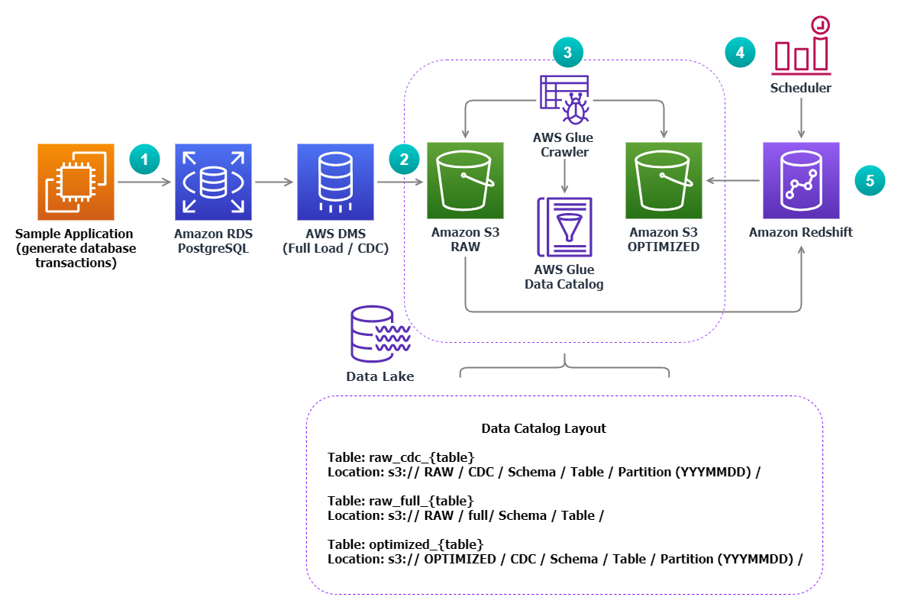

# SQLBasedCDCDataIngestion

Traditionally populating a data warehouse involved running expensive queries overnight, using sophisticated tools and learning domain-specific programming languages to extract, transform and process information at scale.  Often, the complexity of this task required to bring in-demand data engineering skills and/or expensive proprietary tools before even starting the data warehousing journey. 

[Amazon Redshift](https://aws.amazon.com/redshift/) allows you to bring structured and unstructured data from multiple sources like relational databases and [Data Lakes based on Amazon S3](https://aws.amazon.com/products/storage/data-lake-storage/) to gain new insights, create reports and dashboards.  Furthermore, the rich [SQL interface of Amazon Redshift](https://docs.aws.amazon.com/redshift/latest/dg/c_redshift-sql.html) enables you to perform a wide variety of transactions and complex series of tasks on very large datasets. All of this happening within your data warehouse.

In this project we show you how, using only the SQL interface of Amazon Redshift, you can build a pipeline that loads and transforms data from a relational database that uses the [Change Data Capture](https://en.wikipedia.org/wiki/Change_data_capture) (CDC) technique to enable data extraction at scale. Therefore, you no longer need to spend time and effort learning how to use domain-specific programming languages or tools. You can accelerate the journey to generate valuable business insights while leveraging the skillset in your existing database team.

See the AWS architecture diagram below for an overview of a sample solution that you can implement in your own AWS account.



The implementation of this solution consists of five steps:

1. Setup the data source with a sample application.
2. Load the data to S3 and replicate on-going changes (CDC).
3. Discover the Data Lake and populate the catalog with [AWS Glue](https://aws.amazon.com/glue/).
4. Schedule and run the [ELT](https://en.wikipedia.org/wiki/ELT) process in Amazon Redshift.
5. Unload the resulting data to the Optimized zone of the Data Lake.

Before going over each step in detail, let’s deploy the resources from the sample architecture.

## Deployment

1. [AWS Cloud9](https://aws.amazon.com/cloud9/) is a cloud-based integrated development environment (IDE) that provides terminal access with just a browser. Sign in to the [AWS Cloud 9 web console](https://console.aws.amazon.com/cloud9/) and [create an environment](https://docs.aws.amazon.com/cloud9/latest/user-guide/tutorial-create-environment.html) using Amazon Linux 2 as its base platform. 
2. [Open your AWS Cloud9 environment](https://docs.aws.amazon.com/cloud9/latest/user-guide/open-environment.html). On the menu bar (at the top of the AWS Cloud9 IDE), choose **Window**, **New Terminal** (or use an existing terminal window). 
3. In the terminal window, clone the GitHub repository.

```
git clone https://github.com/awslabs/amazon-redshift-utils.git
cd src/SQLBasedCDCDataIngestion
```

1. Open the file `app.py` and adjust the `user_name` parameter to your current IAM user name and `email_address` to your email address. Save your changes.

```
# your user name 
user_name = "administrator"
# your user_name for notifications
email_address="youremail@yourdomain.com"
```

1. Run the deployment script. This will trigger an application built with the [AWS Cloud Development Kit (CDK)](https://aws.amazon.com/cdk/) that will provision the required resources of the solution. This action should be completed in about 10 minutes.

```
./deploy.sh
```

## Walkthrough

### Setup the data source with a sample application 

Now let’s see what happened in the previous step. The first element that you deployed is a relational database built with [Amazon Relational Database Service (RDS) for PostgreSQL](https://aws.amazon.com/rds/) that serves as the main data source of the solution. The database is configured with the [prerequisites](https://docs.aws.amazon.com/dms/latest/userguide/CHAP_Source.PostgreSQL.html#CHAP_Source.PostgreSQL.Prerequisites) to use it as a source for [AWS Database Migration Service](https://aws.amazon.com/dms/) (DMS). 

Then, in order to generate a flow of database transactions to simulate the regular workload of a running application, you deployed an [Amazon EC2](https://aws.amazon.com/ec2) instance hosting a [pgbench](https://www.postgresql.org/docs/11/pgbench.html) performance testing utility that runs every minute, during periods of 30 seconds (`-T 30`), and simulates transactions from 10 clients (`-c 10`). This is performed with a sequence of SQL statements running against for 4 tables:

* pgbench_branches  
* pgbench_tellers  
* pgbench_accounts
* pgbench_history

If you want to customize the parameters that control the workload generated by pgbench, you can use [AWS System Manager Session Manager](https://docs.aws.amazon.com/systems-manager/latest/userguide/session-manager-working-with-sessions-start.html) to quickly and securely [connect to the EC2 instance](https://docs.aws.amazon.com/AWSEC2/latest/UserGuide/session-manager.html). The utility is configured in the operative system scheduler as shown below.

```
sudo cat /etc/cron.d/pgbench_cron
*/2 * * * * root pgbench -c 10 -T 30 -h your_rds.rds.amazonaws.com -p 5432 -U postgres test
```

### Load the data to S3 and replicate on-going changes (CDC)

In order to store the data from the application into the Data Lake, first you deployed S3 buckets corresponding to the Raw zone and the Optimized zone. Next, you setup a replication instance with [AWS Data Migration Service (DMS)](https://aws.amazon.com/dms/) that is linked to a set of source and target endpoints and hosts two migration tasks:


1. **fullload**: Migrates the data from all the database tables, at a particular point in time, to the Raw S3 bucket under the `full/` prefix. It adds an additional column that contains the migration timestamp of each row.
2. **cdcload**: Captures on-going record changes (Inserts, Updates and Deletes) from the database tables and replicates them to the Raw S3 bucket under the `cdc/` prefix. It adds two additional columns: One containing the timestamp of the row change and a second one containing the type of transaction operation applied, like `I` (insert), `U` (update), or `D` (delete).

This AWS DMS setup is highly resilient and self–healing. In case of interruption, it automatically restarts the process and  continues the replication of changes to the target S3 endpoint from the value of its latest checkpoint.

You can see the status of the migration tasks by opening the [AWS DMS Console](https://aws.amazon.com/dms/) and choosing the **Tasks** option of the navigation pane. A table showing the summary of the existing migration tasks will appear.
### Discover the Data Lake and populate the catalog with AWS Glue

All the changes happening in the source database are captured by DMS and replicated into the Raw S3 bucket using the [Apache Parquet](https://parquet.apache.org/) file format. Parquet facilitates metadata discovery through it’s schema on-read feature and increases efficiency on data compression tasks. 

The files corresponding to the full-load table can be found under the prefix:

`bucket-raw-<accountid>-<region>/full/<table_schema>/<table_name> `

The files corresponding to the CDC updates can be found under the prefix: 

`bucket-raw-<accountid>-<region>/CDC/<table_schema>/<table_name>/YYYYMMDD`

Note that a new YYYYMMDD prefix is generated on a daily basis.  It contains files with changes committed during a given day.

In order to discover the data structure, two [AWS Glue](https://aws.amazon.com/glue) crawlers (FullLoad and CDC) are setup to create and update tables in the Glue Data Catalog.  The Glue crawlers connect to the raw data bucket and progress through a prioritized list of classifiers to determine the schema of the data. After this, they update the corresponding table metadata. 

You can manually start both crawlers using the [AWS Glue console](https://aws.amazon.com/glue/). Go to the **Crawlers** section in the left navigation pane, select the desired crawler and click on the **Run crawler** button. Once the process concludes you will be able to see a change in the metric **Tables added** if the tables were discovered in this run, or in **Tables updated** if the tables were already present but a new change had to be updated in the table metadata, such as new date partitions.

On the first run, the FullLoad Glue Crawler will discover 4 tables under its corresponding S3 prefix and store them into the `cdc_database` with a prefix in the table name set as `raw_full_`. The CDC Glue Crawler, on the other hand, will discover 4 tables under its S3 prefix and store them into the `cdc_database` with a prefix in the table name set as `raw_cdc_` and a partitioning strategy using the prefix YYYYMMDD (commit date). 

At this point, all the tables containing data from the full load and the CDC updates are registered in the AWS Glue Data Catalog and available to be queried with services like [Amazon Athena](https://aws.amazon.com/athena/), [Amazon EMR](https://aws.amazon.com/emr/), and [Amazon Redshift Spectrum](https://docs.aws.amazon.com/redshift/latest/dg/c-using-spectrum.html). 

### Schedule and run the ELT process in Amazon Redshift

In this phase you need to ingest the data into the Amazon Redshift cluster. To do this, first you need to [retrieve the credentials stored as a secret](https://docs.aws.amazon.com/secretsmanager/latest/userguide/manage_retrieve-secret.html) named `RedshiftSecret` in [AWS Secret Manager](https://aws.amazon.com/secrets-manager/). Then, open the [Amazon Redshift web console](https://console.aws.amazon.com/redshift/) select **Editor**  from the left navigation pane and select **Query Editor**. Now, you can use the retrieved secret values to [create a new connection](https://docs.aws.amazon.com/redshift/latest/mgmt/query-editor.html#query-editor-connecting) to the `redshiftetldemo` cluster.

Once connected to the `demo` database, you will find 4 tables pre-created for you in the `public` schema.

In order to query your S3 tables using Amazon Redshift Spectrum it is required to have an external schema pointing to the Glue database containing the tables of interest. You can create this external schema by running the following SQL statement in the query editor.

```
`create external schema cdc_database from data catalog database 'cdc_database' 
iam_role '<your-RedshiftSpectrumRole-arn>' create external database if not exists;`
```

You can use the Amazon Redshift console to get the `RedshiftSpectrumRole` ARN. First click on the **CLUSTERS** option of the navigation pane. Then, choose the `redshiftetldemo` cluster and click on the **Properties** tab. You will be able to see the ARN in the **Cluster permissions** section.

Now you are ready to start the ingestion queries. Run a full ingestion from S3 for each table using the following statements.

```
insert into public.pgbench_accounts 
(select * from cdc_database.raw_full_pgbench_accounts);
insert into public.pgbench_branches 
(select * from cdc_database.raw_full_pgbench_branches);
insert into public.pgbench_tellers 
(select * from cdc_database.raw_full_pgbench_tellers;
insert into public.pgbench_history 
(select * from cdc_database.raw_full_pgbench_history);
```

Finally, you need to [create a stored procedure](https://docs.aws.amazon.com/redshift/latest/dg/stored-procedure-overview.html) to load and merge the CDC data on a daily basis. If your business intelligence or reporting tools often need to perform complex analytical queries over large amounts of data, using materialized views is a good option to increase the performance of your queries since you can precompute the desired datasets. Once your tables are updated, it is perfect opportunity to refresh your existing materialized views so that they reflect the latest version of the data. 

The stored procedure on the example below illustrates a typical process that updates the `accounts` table with the latest available changes and then refreshes an existing [materialized view](https://docs.aws.amazon.com/redshift/latest/dg/materialized-view-overview.html) called `weekly_account_change_summary_mv`.  

```
CREATE OR REPLACE PROCEDURE refresh_account_change_summary()
AS $$
    BEGIN
    -- Create staging table with a column for type of operation
    CREATE TABLE IF NOT EXISTS "public"."stage_pgbench_accounts" (LIKE "public"."pgbench_accounts");
    ALTER TABLE "public"."stage_pgbench_accounts" ADD COLUMN op VARCHAR(8);
    -- Save the last version of the previous day records into the staging table
    INSERT INTO "public"."stage_pgbench_accounts" (changets, aid, bid, abalance, filler, op)
    SELECT changets, aid, bid, abalance, filler, op
    FROM (
        SELECT *, row_number() over (partition by aid order by changets desc) AS lastchange
        FROM "cdcdata"."cdc_pgbench_accounts"
        WHERE partition_0>=to_char(DATE(DATEADD(DAY, -1, GETDATE())), 'YYYYMMDD')
    )
    WHERE lastchange=1;
    -- Clean changed records from the original table
    DELETE FROM "public"."pgbench_accounts" USING "public"."stage_pgbench_accounts"
    WHERE "public"."pgbench_accounts"."aid" = "public"."stage_pgbench_accounts"."aid"
    AND "public"."pgbench_accounts"."changets" < "public"."stage_pgbench_accounts"."changets";
    -- Clean pre-existing records from the staging table
    DELETE FROM "public"."stage_pgbench_accounts" USING "public"."pgbench_accounts"
    WHERE "public"."pgbench_accounts"."aid" = "public"."stage_pgbench_accounts"."aid"
    AND"public"."pgbench_accounts"."changets" >= "public"."stage_pgbench_accounts"."changets";
    -- Update the destination table with records from the staging table
    INSERT INTO "public"."pgbench_accounts"
    SELECT changets, aid, bid, abalance, filler
    FROM (
        SELECT * FROM "public"."stage_pgbench_accounts" WHERE op='I' OR op='U'
    );
    -- Refresh the materialized view
    REFRESH MATERIALIZED VIEW "public"."weekly_account_change_summary_mv";
    -- Delete the staging table
    DROP TABLE "public"."stage_pgbench_accounts";
    END;
$$ LANGUAGE plpgsql;
```

You can [schedule a SQL query using the Amazon Redshift web console](https://docs.aws.amazon.com/redshift/latest/mgmt/query-editor-schedule-query.html). This feature enables you to call on a daily basis the stored procedure described in the previous example using the SQL statement below. 

```
CALL refresh_account_change_summary();
```


Follow the prompts to configure the schedule according to your needs:


* In the **Scheduler permissions** section select `redshift_query_schedule_role` as the IAM role and pick AWS Secrets Manager with `RedshiftSecret` as your secret to access the `demo` database.  
* In the **Query information** section, introduce a name for your query.
* For **Scheduling options,** select the desired schedule frequency for your query (time is based on UTC). 
* ** **Lastly in the** Monitoring **section, enable SNS notifications and select the `RedshiftDataFailureTopic` as your SNS topic.

You can have CDC updates merged for additional tables and their corresponding materialized views refreshed by simply appending the corresponding SQL statements to the procedure.

### Unload the resulting data to the Optimized zone of the Data Lake

The AWS DMS CDC streaming task generates multiple small files (under 1MB) in the CDC S3 prefix of the Raw S3 bucket. Having a big number of small files (generally less than 128 MB) represent a challenge for many analytical tools due to the overhead of listing the files, getting each object metadata, opening files individually and so on.  

The solution contains an Unload Python function deployed in [AWS Lambda](https://aws.amazon.com/lambda/) to address this performance issue. This function iterates through all the CDC tables available in the Glue Catalog and initiates an [UNLOAD](https://docs.aws.amazon.com/redshift/latest/dg/r_UNLOAD.html) SQL statement on Redshift to export a lower number of larger files per table into the Optimized S3 bucket. The SQL statements are sent using [Amazon Redshift Data API](https://docs.aws.amazon.com/redshift/latest/mgmt/data-api.html), the API doesn't require a persistent connection to the cluster and all the calls are asynchronous.

```
import boto3
from os import environ
from datetime import date 
from datetime import timedelta

# get all environment variables
glue_database = environ['glue_database']
redshift_database = environ['redshift_database']
redshift_role_arn = environ['redshift_role_arn']
cluster_identifier= environ['cluster_identifier']
secret_arn= environ['secret_arn']

# create all clients
glue_client=boto3.client("glue")
redshift_data_client = boto3.client('redshift-data')

def get_yeterday_partition():
    """
    get partition in YYYYMMDD format - the same as DMS
    """
    return str(date.today() - timedelta(days = 1)).replace("-", "")

def execute_statement(sql_statement, table):
    """
    Executes sql statement using Redshift Data API
    """
    statement_name = f'unload  table - {table} partition - {get_yeterday_partition()}'
    response = redshift_data_client.execute_statement(
        ClusterIdentifier=cluster_identifier,
        Database=redshift_database,
        SecretArn=secret_arn,
        Sql=sql_statement,
        StatementName = statement_name ,
        WithEvent=True)
        
def create_unload_statement(table_name, table_location):
    """
    Creates unload statement for yesterdays date.  Note: change in bucket name for output 
    from -raw- to -optimized-
    """
    optimized_location = table_location.replace("-raw-", "-optimized-")
    yesterday_partition =  get_yeterday_partition()
    sql_statement = f"""
    UNLOAD ('select  * from {glue_database}.{table_name} where partition_0=\\'{yesterday_partition}\\'') 
    TO '{optimized_location}changedate={yesterday_partition}/part_'  
    iam_role '{redshift_role_arn}'
    FORMAT PARQUET
    PARALLEL OFF
    MAXFILESIZE 200 MB
    ALLOWOVERWRITE"""

    return sql_statement


def lambda_handler(event, context):
    
    # get paginator just in case of many tables
    paginator = glue_client.get_paginator('get_tables')
    
    # filter for tables starting with raw_cdc_ as per convention
    response_iterator = paginator.paginate(
        DatabaseName=glue_database,
        Expression='raw_cdc_*',
        PaginationConfig={
            'PageSize': 10
            })
            
    for page in response_iterator:
        for table in page["TableList"]:
            table_name=table['Name']
            
            # for each table create and execute unload statement
            sql_statement = create_unload_statement(table['Name'], table['StorageDescriptor']['Location'])
            execute_statement(sql_statement, table_name)
    
    return "Success"
```

This task is scheduled to be performed daily on the files that were generated a day before. You need to run this demo for at least a day to see the output created in the optimized bucket.


## Cleaning up

To remove all the resources deployed during this demo run the following command from your AWS Cloud9 instance.

```
cd redshiftcdcelt
cdk destroy "*"
```

Clean up your AWS Cloud9 by following the instructions in [Clean up documentation](https://docs.aws.amazon.com/cloud9/latest/user-guide/tutorial-clean-up.html).

## Summary

In this project, we presented a detailed approach to hydrate a data warehouse in a scalable way with streams of RDBMS data using the skillset of a typical database administration team. We showed how the rich SQL interface of Amazon Redshift can help to avoid purchasing expensive proprietary tools and/or acquiring in-demand data engineering skills. Moreover, how it can help your end users to accelerate their journey to get valuable business insights from your data. 

You can follow these guidelines to create and schedule scalable end-to-end data processing pipelines that help you to move your transactional data to Amazon Redshift using the change data capture approach and integrate with your existing Data Lake architecture.
