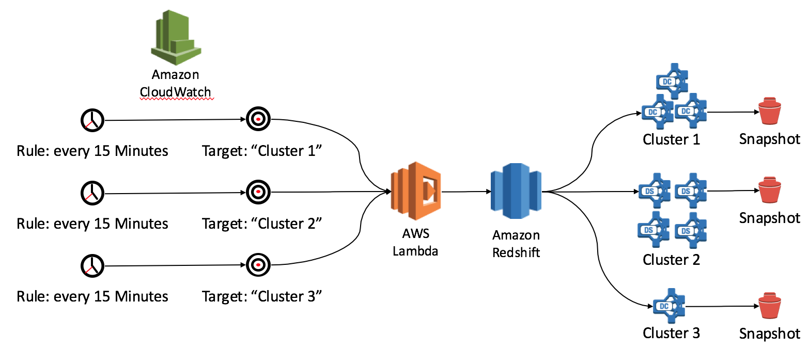

# Amazon Redshift Snapshot Manager

Amazon Redshift is a fast, fully managed, petabyte-scale data warehouse that makes it simple and cost-effective to analyze all your data using your existing business intelligence tools. A Redshift cluster is automatically backed up to Amazon S3 by default, and 3 automatic snapshots of the cluster are retained for 24 hours. You can also convert these automatic snapshots to 'manual', which means they are kept forever. You can restore manual snapshots into new clusters at any time, or you can use them to do table restores, without having to use any third-party backup/recovery software. Snapshots are incremental, which means they only store the changes made since the last snapshot was taken, and are very space efficient.

This module gives you the ability to coordinate the Automatic Snapshot mechanism in your Amazon Redshift Clusters so that you can meet fine grained backup requirements. You don't have to write any code or manage any servers; all execution is done within [AWS Lambda](https://aws.amazon.com/lambda), and scheduled with [Amazon CloudWatch Events](http://docs.aws.amazon.com/AmazonCloudWatch/latest/DeveloperGuide/WhatIsCloudWatchEvents.html).



## Addressing your Disaster Recovery requirements

There are two dimensions to disaster recovery which must be carefully considered when running a system at scale:

* RTO: Recovery Time Objective - how long does it take to recover from an outage scenario?
* RPO: Recovery Point Objective - when you have recovered, at what point in time will the system be consistent to?

A comprehensive overview of how to build systems which implement best practices for disaster recovery can be found [the AWS Disaster Recovery Whitepaper](https://aws.amazon.com/blogs/aws/new-whitepaper-use-aws-for-disaster-recovery/).

### Recovery Time Objective in Redshift

When using Amazon Redshift, the recovery time is determined by __the node type you are using__, __how many of those nodes you have__, and the __size of the data being restored__. It is vital that you practice restoration from snapshots created on the cluster to correctly determine the actual recovery time you'll see, so as to ensure your customer's expectations are met. This must be retested  any time you resize the cluster, or if your data volume changes significantly.

### Recovery Point Objective in Redshift

Amazon Redshift's automatic recovery snapshots are created every 8 hours, or every 5GB of data changed on disk, whichever comes first. For some customers, an 8 hour RPO is too long, and they require the ability to take snapshots more frequently. For other customers who have a very large amount of data change, these snapshots may be taken far too frequently and not allow long enough retention. 

That's where this module comes in - by supplying a simple configuration, you can ensure that snapshots are taken on a fixed time basis that meets your needs for data recovery.

## Getting Started

### Install Pre-requisites

The included build script requires that you be able to use a terminal/command line, and have the [aws-cli](https://aws.amazon.com/cli), python (2.7x), [boto3](https://github.com/boto/boto3), and [shortuuid](https://pypi.python.org/pypi/shortuuid) installed. Alternatively you can deploy the zip file in the ['dist'](dist/RedshiftSnapshotManager-1.0.0.zip) folder and configure through the AWS Console.

### Deploy the Lambda Function

You can deploy this AWS Lambda function by hand using the AWS Console or Command Line tools, or alternatively you can run:

```build.sh deploy <role-arn>```

where `<role-arn>` is the Amazon Resource Name for the IAM you want the function to run as (which determines what it can do). This Role will require at least the following permissions:

```
{
    "Version": "2012-10-17",
    "Statement": [
        {
            "Sid": "Stmt1466597619000",
            "Effect": "Allow",
            "Action": [
                "redshift:CopyClusterSnapshot",
                "redshift:CreateClusterSnapshot",
                "redshift:CreateTags",
                "redshift:DeleteClusterSnapshot",
                "redshift:DescribeClusterSnapshots"
            ],
            "Resource": [
                "*"
            ]
        },
        {
            "Effect": "Allow",
            "Action": [
              "logs:CreateLogGroup",
              "logs:CreateLogStream",
              "logs:PutLogEvents"
            ],
            "Resource": "arn:aws:logs:*:*:*"
        }
    ]
}

```

You only need to deploy the function once to support a virtually unlimited number of clusters. The function will be configured with:

* Max Runtime: 60 Seconds (each function only runs for 1 cluster, so this is plenty long enough - you can even reduce it)
* Memory Size: 128 MB (the minimum)
* Runtime: Node.js 4.3

### Schedule Execution

This Lambda function can be run by any scheduler, but [AWS CloudWatch Scheduled Events](http://docs.aws.amazon.com/AmazonCloudWatch/latest/DeveloperGuide/WhatIsCloudWatchEvents.html) are a great way to ensure your function runs on a fixed schedule, without the need for any servers. You can configure CloudWatch Events to be used as the event source for your function, and this can include the configuration for which cluster to work on! To do this, you can add the `schedule` directive to the previous deploy command:


```build.sh deploy <role-arn> schedule <config.json>```

The supplied configuration file must include:

* `namespace` A unique namespace for the backup schedule that will be used to identify the snapshots created
* `targetResource` The name of your Redshift Cluster, excluding `<region>.amazonaws.com`
* `region` The region where your Redshift Cluster resides
* `snapshotIntervalHours` The Recovery Point Objective that is used to ensure you take snapshots on the specified interval
* `snapshotRetentionDays` How long snapshots should be retained before being deleted. Manual snapshots (which can be restored into new clusters) will be kept forever by default. This is an optional parameter, and when omitted all snapshots will be retained.

```
{
	"namespace": "my-every-2-hour-schedule",
	"targetResource": "my-redshift-cluster",
	"region": "us-east-1",
	"snapshotIntervalHours": 2,
	"snapshotRetentionDays": 7
}
```

Once deployed, you can edit the above configuration from the definition of the CloudWatch Events Rule.

Please note that the current account limit for Redshift manual snapshots is 20 per region. This module will create `24/snapshotIntervalHours * snapshotRetentionDays` snapshots, and so if this number is greater than 20 please open an AWS support case to have the limit increased. For example, an RPO of 2 hours with 7 days retention (as shown above) will create `24/2 * 7 = 84` snapshots.

Running the schedule command will create a CloudWatch Events Schedule that runs your function every __15 Minutes__. This means that your snapshots will be taken within 15 minutes of the specified snapshots interval.

### What's Created

After completion, you'll notice a Lambda Function called `RedshiftUtilsSnapshotManager`, plus there will be a CloudWatch Events Rule called `RedshiftUtilsSnapshotManager-<namespace>-15-mins` which runs every 15 minutes.

You can run `./build.sh schedule <config.json>` as many times as you need to create additional schedules or modify existing schedules (based on the namespace supplied in the config file).

### Confirm Execution

Once running, you will see that existing automatic snapshots, or new manual snapshots are created within the ```snapshotIntervalHours```. These snapshots are called ```rs-snapman-<cluster-name>-<yyyy>-<mm>-<dd>t<hh><mi><ss>```, and are tagged with:

* ```createdBy=AWS Redshift Utils Snapshot Manager```
* ```creationTimestamp=YYYY-MM-DD-HHmmss```
* ```scheduleNamespace=<config.namespace>```


__Only snapshots which are tagged using this scheme will be deleted by this utility - other snapshots are not affected.__ You can review the Lambda function's CloudWatch Log Streams for execution details, which include output about what the function is doing.

## Making Changes

IF you'd like to make changes, then great - we love open source. You can code your changes, and then you'll need to pull in the Node.js dependencies in order to test or deploy. From the `src/SnapshotManager` folder, run `npm install`, which will perform this download. You can then create a new Lambda zip archive by running `./build.sh assemble`, which will create `RedshiftSnapshotManager-<version>.zip` in the the `dist` folder. You can then run `./build.sh deploy...schedule...` as before.

----

Amazon Redshift Utils Snapshot Manager

Copyright 2014-2015 Amazon.com, Inc. or its affiliates. All Rights Reserved.

Licensed under the Amazon Software License (the "License"). You may not use this file except in compliance with the License. A copy of the License is located at

	http://aws.amazon.com/asl/

or in the "license" file accompanying this file. This file is distributed on an "AS IS" BASIS, WITHOUT WARRANTIES OR CONDITIONS OF ANY KIND, express or implied. See the License for the specific language governing permissions and limitations under the License.
