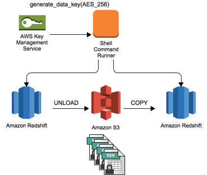

# Amazon Redshift Unload/Copy Utility

The Amazon Redshift Unload/Copy Utility helps you to migrate data between Redshift Clusters or Databases. It exports data from a source cluster to a location on S3, and all data is encrypted with Amazon Key Management Service. It then automatically imports the data in FULL into the configured Redshift Cluster, and will cleanup S3 if required. This utility can be used as part of an ongoing scheduled activity, for instance run as part of a Data Pipeline Shell Activity (http://docs.aws.amazon.com/datapipeline/latest/DeveloperGuide/dp-object-shellcommandactivity.html) but it can also be used standalone for creating a copy of a table into another cluster.




## Encryption

The Unload/Copy Utility instructs Redshift to use client-side encryption with a customer-managed key (CSE-CMK).  For this a 256-bit AES key is used for unloading the data in a secure manner to S3 and then used again by the target cluster to decrypt files from S3 and load them.  At no time is this key persisted to disk, it is lost when the program terminates.
In order to get this customer-managed key the utility provides 2 possibilities:

### Use KMS to generate a temporary client key

A Customer Master Key is created with the ```createKmsKey.sh``` script, and an alias to this key named 'alias/RedshiftUnloadCopyUtility' is used for all references. The Unload/Copy utility then gets an AES_256 Master Symmetric Key from KMS which is used to encrypt data on S3,

### Let Python generate a temporary random client key

Since the key is used as a temporary resource it can be a random 256 bit sequence therefore it can be generated locally.

If you have an version of Python that is older than `3.6` then you will need to install pycrypto, this can be done using `pip install pycrypto`.  For newer versions of Python the secrets module will be used.

:information_source: In order to have Python do this the configuration file should have `"kmsGeneratedKey": "True"` in the `"s3Staging"` section as the default will use KMS as described above.

## Data Staging Format

Data is stored on Amazon S3 at the configured location as AES 256 encrypted CSV files, gzipped for efficiency. The delimiter is carat '^'. We also add the following options on UNLOAD/COPY to ensure effective and accurate migration of data between systems:

```
ADDQUOTES
ESCAPE
ALLOWOVERWRITE
```

Data is exported to S3 to the configuration location. A date string of format `%Y-%m-%d_%H:%M:%S` will be generated per execution and used as first part of the path to the object. Next the file names for a table will start with `{db_name}.{schema_name}.{table_name}`.

## Configuration

The utility is configured using a json configuration file, which can be stored on the local filesystem or on Amazon S3. To use Amazon S3, prefix the file location parameter with 's3://'. An example configuration to help you get started can be found in the [example configuration file](example/config.json).

### Using temporary cluster credentials (password)

If no password is specified then the utility will try to use the [GetClusterCredentials-API](http://docs.aws.amazon.com/redshift/latest/APIReference/API_GetClusterCredentials.html) in order to get temporary credentials for the specified user.  
For this the application needs access to [credentials](http://boto3.readthedocs.io/en/latest/guide/configuration.html) itself which would allow to get these cluster credentials.  More info on how this works is available in the [AWS Redshift documentation](http://docs.aws.amazon.com/redshift/latest/mgmt/generating-iam-credentials-cli-api.html).


### Sensitive configuration parameters like passwords and access keys

:information_source: Ideally copy statements use a Role ARN and cluster access is performed using temporary cluster credentials (see above).  If your use case does not allow that KMS needs to be used in order to pass secrets securely. 

All passwords and access keys for reading and writing from Amazon S3 are encrypted using the Customer Master Key for the utility. Prior to creating the configuration file, you must run ```createKmsKey.sh```, and then use the ```encryptValue.sh``` script to generate the base64 encoded encrypted configuration values. For example, to encrypt the value 'myPassword' with a customer master key stored in `eu-west-1`:

```
UnloadCopyUtility meyersi$ ./encryptValue.sh myPassword eu-west-1

CiCUY+94HI56hhvt+IZExFl5Ce47Qrg+ptqCnAHQFHY0fBKRAQEBAgB4lGPveByOeoYb7fiGRMRZeQnuO0K4PqbagpwB0BR2NHwAAABoMGYGCSqGSIb3DQEHBqBZMFcCAQAwUgYJKoZIhvcNAQcBMB4GCWCGSAFlAwQBLjARBAwcOR73wpqThnkYsHMCARCAJbci0vUsbM9iZm8S8fhkXhtk9vGCO5sLP+OdimgbnvyCE5QoD6k=
```

This value is then pasted into the configuration file.

## Running the Utility

The utility takes at minimum 2 parameters:

```
<s3ConfigFile> Path to local file or S3 Path to Configuration File on S3"
<region> Region where Configuration File is stored (S3) and where Master Keys and Data Exports are stored
```

When passing in parameters via command line words get separated with a `-` and are all lower-case. For example, to run the utility with a configuration file stored in a bucket in `eu-west-1`:

```
python redshift-unload-copy.py --s3-config-file s3://my-bucket/my-unload-copy-config.json --region eu-west-1
```

All available parameters are defined in [`global_config_parameters.json`](global_config_parameters.json) and have an elaborate description over there.
The parameters in that file will allow to use additional features (e.g. --destination-table-auto-create will generate DDL for the source table and use that in the target cluster to create a table with similar structure.)

Please note that the bucket where the configuration is stored, and where the encrypted data is staged in S3 must be in the same AWS Region

## Install Notes

This utility uses PyGreSQL to connect to your Redshift Clusters. To install PyGreSQL (Python PostgreSQL Driver) on Amazon Linux, please ensure that you follow the below steps as the ec2-user:

```
sudo easy_install pip
sudo yum install postgresql postgresql-devel gcc python-devel libffi-devel
sudo pip install PyGreSQL boto3 pytz
```

On other Linux distributions, make sure that you install the PostgreSQL client version 9.0 or higher.
