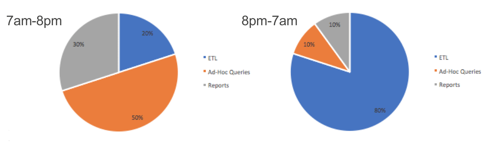

# Redshift Workload Management Scheduler

Redshift supports a powerful Workload Management feature through the [WLM system](https://docs.aws.amazon.com/redshift/latest/dg/c_workload_mngmt_classification.html). This gives you the ability to create segregated sets of users where capacity is allocated to that group, and behaviour can be controlled at a very fine grained level.

This utility gives you a convenience mechanism to dynamically change your WLM configuration in Redshift based on a schedule. This is commonly needed if you load your tables only periodically, but then have ad-hoc query users over time. When you perform data loads, you may wish to reconfigure the system to support more memory allocation and longer running queries:



Execution is integrated to the [Redshift Automation](https://github.com/awslabs/amazon-redshift-utils/tree/master/src/RedshiftAutomation) project for scheduling and deployment, and can be run through the `ra` command line. Changes to your WLM configuration do not require a restart, and will be applied by the system automatically. A single deployment of WlmScheduler can automate a virtually unlimited number of cluster updates across any number of AWS Regions.

Workload Management Scheduling is automated by providing a configuration file on Amazon S3 which outlines which Parameter Groups (which contain the WLM configuration) should be modified, and when. The basic structure of this file is:

```
{
  "parameter-group-name": "my-parameter-group",
  "apply-region":"eu-west-1",
  "rulesets": [
    {
      "name": "My Daytime Ruleset",
      "active-interval": "03:00-20:00",
      "configuration": "s3://my-bucket/prefix/my-daily-schedule.json"
    },
    {
      "name": "My Loading Ruleset",
      "active-interval": "20:00-03:00",
      "configuration": [ <wlm configuration> ]
    },
    ...
  ]
 }
```

The key elements of this configuration include:

* `parameter-group-name` - This is the parameter group to modify
* `apply-region` - This is the region where your Redshift cluster resides.
* `rulesets` - list of WLM configurations to apply. These have the following structure:
	* `name` - this is the name of the WLM configuration to apply. This will appear in logging messages but doesn't have an impact on the system. Choose a descriptive name that lets you know
	* `active-interval` - an interval expression used to determine when the configuration should be applied. It takes the form of `<start time>-<end time>`, where either of these times are expressed as `HH:MI` formatted strings. These values are validated and should be continguous across all rulesets in the configuration
	* `configuration` - A WLM configuration to be applied during this period. This parameter can either be a valid WLM configuration, which is easy to generate with the Redshift Console, or alternatively a reference to a file containing a configuration on S3.
	
	
## Getting Started

In order to use this utility, you will create a configuration file that meets the above format on Amazon S3. We generally recommend that you configure the WLM configuration using the Redshift Console, which will produce valid JSON to be included in the tool. You can enclose each configuration in a separate file, which will be simpler to maintain over time, and each of these files is stored in s3, and the path added to the configuration parameter for each ruleset. You can view an example configuration [here](example-config.json).

## Deploying and Running

This module is orchestrated via the [Redshift Automation](https://github.com/awslabs/amazon-redshift-utils/tree/master/src/RedshiftAutomation) project, which includes comprehensive deployment instructions. During the deployment of this module, you will be prompted for the WLM Configuration File location on s3, and the frequency to run the utility. We expect that this utility should run no more than hourly, but you can change this as your requirements vary.
